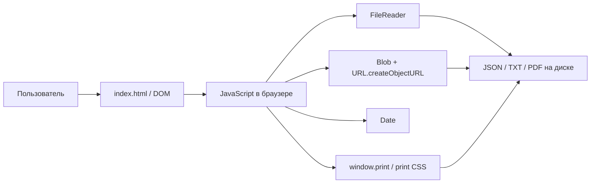
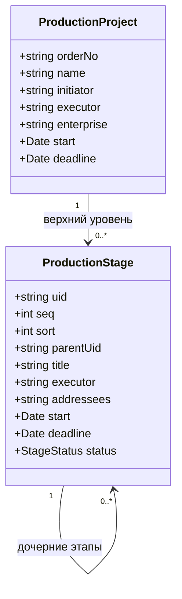
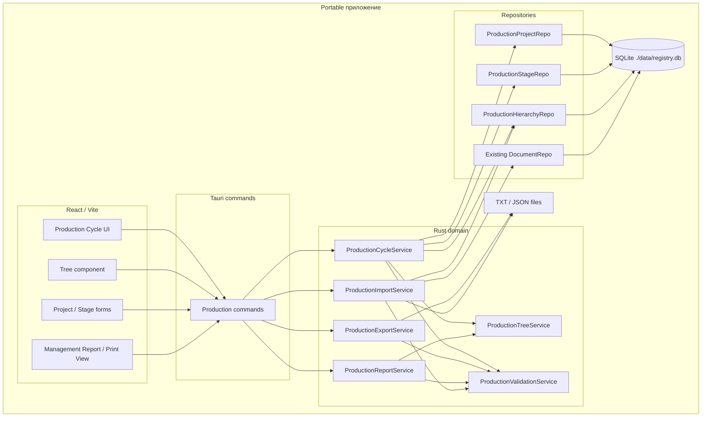
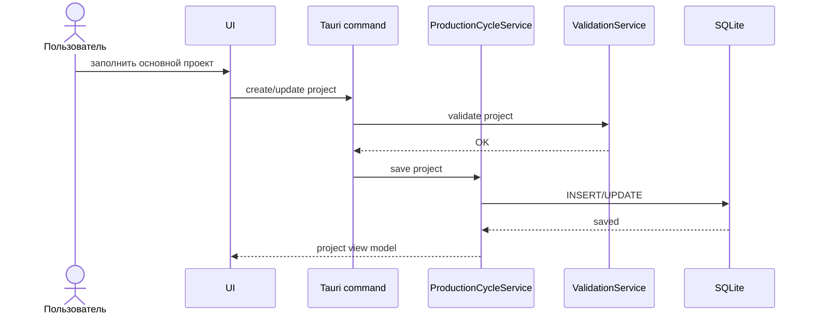
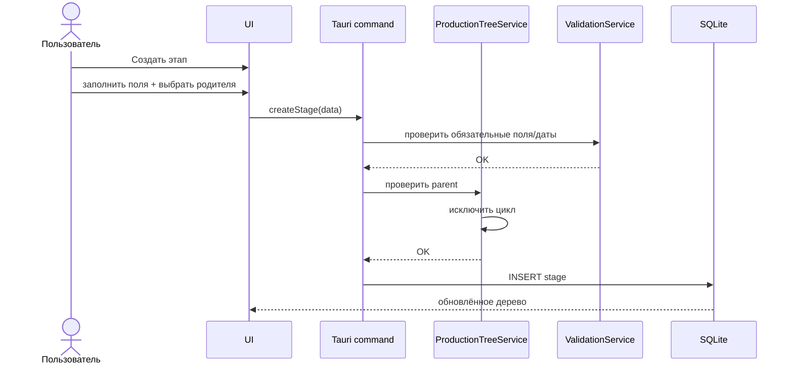
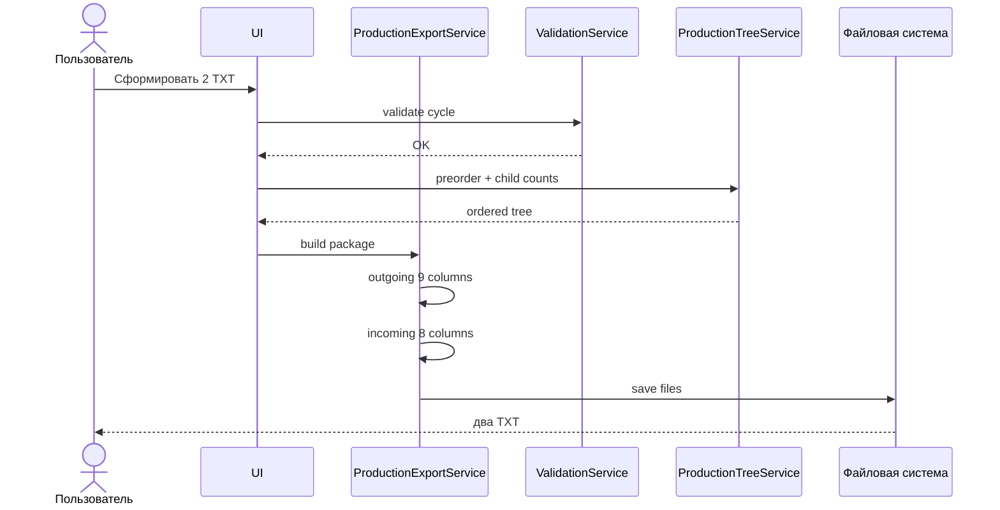
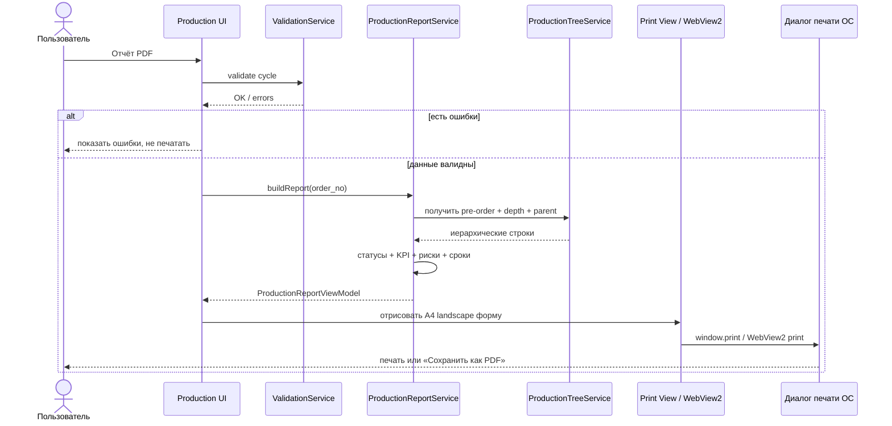
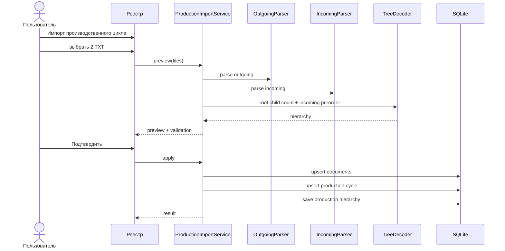
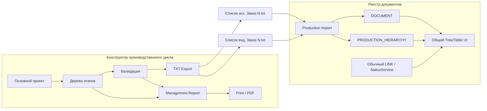

# Производственный цикл — концепция, архитектура и интеграция с «Реестром документов»

> **Статус документа:** проектная техническая документация\
> **Версия:** 0.2\
> **Дата фиксации:** 2026-09-08\
> **Основание:** утверждённая концепция «Реестра документов» и рабочий локальный HTML-прототип конструктора производственного цикла v8.\
> **Назначение документа:** зафиксировать основную идею модуля, границы ответственности, структуру зависимостей, модель данных, backend-логику, формат обмена и правила интеграции без разрушения существующей доменной модели Реестра.

> **Ревизия 0.2 (2026-09-08):** добавлен управленческий отчёт по конкретному производственному проекту с выводом через локальную печатную форму в PDF. Зафиксированы состав отчёта, расчёт KPI/рисков, print-архитектура, backend-сервис отчётности, тесты и критерии готовности. TXT-контракт не изменён.

> **Рабочее дополнение (2026-09-09):** добавлены перечень SQLite-проектов, импорт пары TXT, экранная фильтрация выполненных этапов и отдельная диаграмма Ганта. Экранный фильтр не влияет на сохранение, экспорт и PDF.

## Правила новой рабочей навигации

- Главная вкладка содержит только карточку проекта, действия и реестр этапов.
- Справочное описание TXT/LINK убрано из постоянного рабочего поля.
- Визуальная схема подчинённости сохранена как обзор всего проекта и получила независимое сворачивание.
- Родитель каждого этапа показан явным визуальным маркером «Связь → …».
- Вторая вкладка строит диаграмму Ганта по датам этапов.
- Масштаб Ганта меняет только временную сетку: календарные дни, недели с понедельника или календарные месяцы. Даты этапов не пересчитываются.
- Гант имеет отдельную печатную форму; пользователь до открытия системного диалога выбирает A4 landscape или A3 landscape.
- Режим «Только невыполненные» скрывает `done` лишь на экране. Модель проекта не изменяется, а PDF сохраняет все строки и полный процент выполнения.
- «Все проекты» получает список из SQLite, сортирует его по времени последнего сохранения и открывает выбранный `order_no`.

## Импорт пары TXT

До изменения рабочего поля проверяются UTF-8 BOM, CRLF, точные заголовки 9/8 колонок, число колонок, календарные даты, идентификаторы и счётчики прямых детей. Иерархия восстанавливается только по порядку строк и первой колонке. `LINK` не используется. Поскольку ручного статуса в TXT-контракте нет, каждому импортированному этапу присваивается `new`; предупреждение показывается до подтверждения. В native-режиме подтверждённый импорт сразу сохраняется в SQLite.

---

## 0. Краткое резюме

Модуль **«Производственный цикл»** предназначен для создания пользователем иерархии производственного заказа и преобразования этой иерархии в **два стандартных TXT-файла**, совместимых по структуре с действующими форматами импорта «Реестра документов»:

1. **основной производственный проект** формируется как **одна строка исходящего документа**;
2. **производственные этапы** формируются как **строки входящих документов**;
3. вложенность этапов строится по принципу **«один элемент — один родитель»**;
4. глубина вложенности не ограничивается бизнес-логикой;
5. дополнительные технические колонки в TXT **не добавляются**;
6. поле **«Ссылка»** не используется для скрытых служебных данных: если реальной ссылки нет, поле остаётся пустым;
7. структура дерева кодируется только через:
   - количество прямых дочерних элементов в первой штатной колонке;
   - порядок строк входящего TXT — **обход дерева сверху вниз (pre-order)**;
8. существующий статусный `LINK` Реестра **не используется** для производственной вложенности, потому что он имеет другую доменную семантику и влияет на статус исходящей задачи.
9. по текущему проекту формируется отдельный **управленческий отчёт PDF**: реквизиты проекта, статус, KPI по этапам, риски по срокам и полная иерархическая таблица;
10. PDF-отчёт строится локально и не меняет данные проекта или TXT-экспорт.

Ключевая идея: **производственный цикл должен использовать совместимый формат документов, но не должен подменять или ломать логику обычной входящей/исходящей корреспонденции.**

---

# 1. Основная идея программы

## 1.1. Проблема

В производственной работе один заказ обычно состоит не из одной задачи, а из набора взаимосвязанных элементов:

```text
Заказ № 3888
├── Изготовить блок 1
│   ├── Заказать комплектующие
│   └── Провести контроль
├── Изготовить блок 2
└── Провести испытания
```

Для пользователя это не просто список независимых строк. Это **единый производственный цикл**, в котором каждый элемент имеет своё место в общей структуре, исполнителя, срок и состояние.

При этом базовая программа «Реестр документов» уже имеет собственную модель входящей и исходящей корреспонденции и собственную статусную логику. Изменять эту модель ради производственного дерева нельзя.

## 1.2. Решение

Создаётся отдельная утилита/модуль **«Конструктор производственного цикла»**.

Пользователь в ней:

- создаёт основной производственный проект;
- задаёт номер заказа;
- указывает инициатора/подписанта;
- указывает исполнителя/получателя;
- указывает предприятие;
- задаёт начало и дедлайн;
- создаёт этапы;
- для каждого этапа задаёт родителя;
- для каждого этапа задаёт исполнителя, адресатов, начало, дедлайн и статус;
- визуально видит иерархию;
- получает два TXT-файла для последующей обработки Реестром.
- формирует управленческий отчёт по текущему состоянию проекта для представления руководителю;
- выводит отчёт через локальную печатную форму с сохранением в PDF средствами браузера/WebView2.

## 1.3. Что пользователь НЕ создаёт

Пользователь **не создаёт вручную обычные документы Реестра**.

Внутри конструктора он создаёт **производственный проект и его этапы**. Только на этапе экспорта эта производственная модель преобразуется в формат двух документных выгрузок.

Это принципиальное разделение:

```text
Бизнес-сущности конструктора:
Проект → Этап → Дочерний этап

           ↓ адаптация

Формат обмена Реестра:
Исходящий документ + Входящие документы
```

---

# 2. Границы ответственности

## 2.1. Конструктор производственного цикла отвечает за

- создание основного проекта;
- создание и редактирование этапов;
- формирование дерева;
- контроль правила «один элемент — один родитель»;
- автоматическую выдачу ID этапов;
- хранение порядка дочерних элементов;
- визуализацию вложенности;
- проверку обязательных полей;
- проверку дат;
- расчёт визуального состояния и оставшихся дней;
- сохранение рабочего проекта в JSON;
- загрузку рабочего проекта из JSON;
- формирование двух стандартных TXT;
- сохранение пустого поля `Ссылка`, если реальной ссылки нет;
- формирование управленческой модели отчёта по проекту;
- расчёт KPI и рисков по этапам;
- подготовку печатной формы A4 и запуск локального диалога печати/сохранения PDF.

## 2.2. Конструктор не отвечает за

- штатную регистрацию корреспонденции 1С;
- изменение существующей статусной модели Реестра;
- закрытие исходящей задачи входящим письмом;
- создание штатного `LINK` Реестра для производственных связей;
- темы обычных исходящих писем;
- обычный импорт корреспонденции;
- автоматическое изменение статуса обычного исходящего письма.
- серверную генерацию PDF и передачу отчёта во внешние сервисы.

## 2.3. Реестр документов остаётся владельцем

- таблицы документов;
- штатных импортов исходящих и входящих;
- обычных связей писем;
- вычисления статуса исходящей корреспонденции;
- тем;
- дедлайнов обычных исходящих задач;
- печатных форм обычного Реестра;
- общей визуализации реестра.

Управленческий отчёт **производственного проекта** принадлежит production-модулю и не заменяет печатные формы обычного Реестра.

---

# 3. Главный архитектурный инвариант

Производственную иерархию **нельзя записывать в существующий статусный `LINK`**.

Причина: в действующей концепции Реестра `LINK` имеет бизнес-смысл:

```text
исходящая задача + привязанное входящее письмо
→ Выполнено

исходящая задача + повторное исходящее письмо
→ В доработке
```

Если использовать тот же `LINK` для конструкции:

```text
Заказ → Этап
```

то первый импортированный «входящий этап» будет ошибочно воспринят как подтверждающее входящее письмо и может перевести основной проект в статус «Выполнено».

Следовательно:

> **производственная вложенность и статусная связь документов — разные типы отношений.**

Для production-версии необходим отдельный слой производственной иерархии.

---

# 4. Текущий HTML-прототип v8

## 4.1. Техническая модель

Текущая версия — автономный `index.html`.

Она не имеет серверного backend и работает целиком в браузере.

Фактические зависимости:



Внешних библиотек, CDN и сетевых запросов в прототипе не требуется. Управленческий PDF-отчёт формируется как скрытая печатная HTML-форма и выводится через `window.print()`; сохранение в PDF выполняется штатным механизмом браузера/WebView2/ОС.

## 4.2. Текущее состояние в памяти

```text
state
├── project
│   ├── name
│   ├── orderNo
│   ├── initiator
│   ├── executor
│   ├── addressees
│   ├── start
│   └── deadline
│
├── stages[]
│   ├── uid
│   ├── seq
│   ├── sort
│   ├── parentUid
│   ├── title
│   ├── executor
│   ├── addressees
│   ├── start
│   ├── deadline
│   └── status
│
├── nextSeq
└── collapsed
```

## 4.3. Внутренний UID и экспортный ID

У этапа есть два идентификатора разных уровней.

### `uid`

Внутренний технический идентификатор текущего проекта.

Используется для:

- ссылки на родителя;
- поиска элемента в памяти;
- управления UI;
- удаления ветки;
- защиты от циклического назначения родителя.

### экспортный ID

Формируется как:

```text
<номер заказа>-<порядковый номер из 3 цифр>
```

Пример:

```text
3888-001
3888-002
3888-003
```

ID сохраняется за этапом через `seq`. Перемещение этапа под другого родителя не должно менять `seq` и, следовательно, не должно менять ID.

---

## 4.4. Управленческий отчёт PDF в v8

На главной панели прототипа добавлена кнопка **«Отчёт PDF»**. Она не создаёт новый документ Реестра и не изменяет производственный проект. Это представление текущего состояния уже введённых данных.

Перед формированием отчёта выполняется общая валидация проекта. Если есть ошибки обязательных полей или структуры, печать не запускается.

Отчёт содержит:

- название проекта;
- номер заказа;
- предприятие;
- инициатора;
- исполнителя;
- период проекта;
- общий статус проекта;
- дату и время формирования;
- количество этапов;
- количество и долю выполненных этапов;
- количество этапов в работе;
- количество просроченных;
- количество не начатых;
- количество приостановленных;
- предупреждения о просрочках;
- предупреждения об этапах со сроком в ближайшие 7 календарных дней;
- предупреждения о приостановленных этапах;
- полную иерархическую таблицу этапов.

Процент выполнения рассчитывается как:

```text
donePercent = round(doneStages / totalStages * 100)
```

Если этапов нет, процент принимается равным `0`.

Таблица отчёта содержит колонки:

```text
№ | ID | Этап / структура | Исполнитель | Статус | Начало | Дедлайн | Осталось
```

Вложенность в отчёте показывается отступом и явным указанием родителя. Просроченные и приостановленные строки визуально выделяются в печатной форме.

Печатный CSS настроен на:

- формат A4;
- альбомную ориентацию;
- повтор заголовка таблицы на следующих страницах;
- запрет разрыва одной строки этапа между страницами, когда это поддерживается печатным движком;
- печать фоновых индикаторов статусов (`print-color-adjust: exact`).

Имя документа перед печатью временно устанавливается в формате:

```text
Отчёт Заказ <номер>
```

Это помогает получить понятное предлагаемое имя PDF в системном диалоге печати.

# 5. Бизнес-модель

## 5.1. Основной проект

Основной проект является корнем дерева.

Обязательные пользовательские поля текущей версии:

| Поле UI | Назначение в утилите | Поле исходящего TXT |
|---|---|---|
| Название проекта | наименование заказа/проекта | `Заголовок` |
| Номер заказа | основной идентификатор проекта | `Регистрационный номер` |
| Инициатор / подписант | инициатор проекта | `Подписант` |
| Исполнитель / получатель | основной исполнитель/получатель | `Получатель исходящего` |
| Предприятие | предприятие проекта | `Адресаты` |
| Начало | начало проекта | `Дата` |
| Дедлайн | срок проекта | `Срок исполнения` |

Автоматические поля:

| Поле исходящего TXT | Правило |
|---|---|
| Количество связей, поясняющих суть документа | число прямых этапов верхнего уровня |
| Ссылка | пустая строка, пока нет реальной ссылки |

## 5.2. Этап

Этап является дочерним элементом проекта или другого этапа.

Обязательные поля:

| Поле UI | Назначение | Поле входящего TXT |
|---|---|---|
| Название этапа / краткое содержание | содержание работ | `Краткое содержание` |
| Родитель | положение элемента в дереве | напрямую в отдельную колонку не экспортируется |
| Исполнитель / корреспондент | исполнитель этапа | `Корреспондент` |
| Адресаты | адресаты этапа | `Адресаты` |
| Начало | дата начала этапа | `Дата регистрации` |
| Дедлайн | срок этапа | `Срок исполнения` |
| Статус | рабочее состояние этапа в конструкторе | **в стандартном TXT отдельной колонки нет** |

Автоматические поля:

| Поле входящего TXT | Правило |
|---|---|
| Рег. номер | `<номер заказа>-NNN` |
| Количество связей, поясняющих суть документа | число прямых дочерних этапов |
| Ссылка | пустая строка, пока нет реальной ссылки |

---

# 6. Иерархическая модель

## 6.1. Кардинальность

Для каждого этапа действует правило:

```text
один этап → один родитель
```

Родителем может быть:

- основной проект;
- другой этап того же проекта.

Один родитель может иметь любое число дочерних элементов.



## 6.2. Запрет циклов

Нельзя сделать элемент потомком самого себя.

Нельзя назначить родителем:

- сам редактируемый этап;
- любого его потомка.

Прототип получает множество потомков редактируемого узла и исключает их из списка допустимых родителей.

## 6.3. Удаление

Удаление родительского этапа удаляет всю его дочернюю ветку.

Это соответствует дереву, а не независимому набору строк.

---

# 7. Статусы производственных этапов

В HTML v7 используются следующие внутренние состояния:

```text
new  → Не начато
work → В работе
hold → Приостановлено
done → Выполнено
```

Дополнительно UI вычисляет визуальное состояние `overdue` — «Просрочено».

Логика отображения:

1. `done` остаётся «Выполнено»;
2. `hold` остаётся «Приостановлено»;
3. если текущая дата раньше начала → «Не начато»;
4. если текущая дата позже дедлайна → «Просрочено»;
5. иначе используется `new` или `work`.

### Важное ограничение TXT-контракта

Стандартный входящий TXT имеет 8 колонок и **не содержит отдельного поля статуса**.

В версии v7 техническая метка из поля `Ссылка` удалена по требованию пользователя. Следовательно:

> **ручной статус `Не начато / В работе / Приостановлено / Выполнено` нельзя полностью восстановить только из двух TXT-файлов v7.**

Из дат можно вычислить только часть состояния (`не начато`, `просрочено`), но нельзя достоверно восстановить `Выполнено` или `Приостановлено`.

Это не ошибка TXT-генератора — это ограничение утверждённого восьмиколоночного формата входящей выгрузки.

Для production-интеграции этот вопрос должен быть решён отдельно одним из способов:

1. хранить производственный статус в отдельной таблице SQLite, если конструктор встроен в основную программу;
2. хранить статус в рабочем JSON проекта и использовать JSON как служебный источник состояния;
3. отказаться от переноса ручного статуса через TXT и рассчитывать состояние после импорта по отдельным правилам.

Добавлять скрытый текст в поле `Ссылка` без отдельного решения **запрещено**.

---

# 8. Формат исходящего TXT

## 8.1. Заголовок

Ровно 9 колонок:

```text
Количество связей, поясняющих суть документа
Регистрационный номер
Дата
Получатель исходящего
Заголовок
Подписант
Срок исполнения
Адресаты
Ссылка
```

## 8.2. Формирование строки основного проекта

```text
1. Количество связей = количество прямых этапов проекта
2. Регистрационный номер = номер заказа
3. Дата = начало проекта в формате ДД.ММ.ГГ
4. Получатель исходящего = исполнитель / получатель
5. Заголовок = название проекта
6. Подписант = инициатор / подписант
7. Срок исполнения = дедлайн в формате ДД.ММ.ГГГГ
8. Адресаты = значение UI-поля «Предприятие»
9. Ссылка = пусто, если реальной ссылки нет
```

## 8.3. Пример

```text
2<TAB>916<TAB>16.09.26<TAB>Кириллов<TAB>Авиаста 5п<TAB>Пересветов<TAB>22.10.2026<TAB>КГЭ<TAB>
```

---

# 9. Формат входящего TXT

## 9.1. Заголовок

Ровно 8 колонок:

```text
Количество связей, поясняющих суть документа
Краткое содержание
Рег. номер
Дата регистрации
Корреспондент
Адресаты
Срок исполнения
Ссылка
```

## 9.2. Формирование строки этапа

```text
1. Количество связей = количество прямых дочерних этапов
2. Краткое содержание = название этапа
3. Рег. номер = <номер заказа>-NNN
4. Дата регистрации = начало этапа в формате ДД.ММ.ГГГГ
5. Корреспондент = исполнитель этапа
6. Адресаты = адресаты этапа
7. Срок исполнения = дедлайн этапа
8. Ссылка = пусто, если реальной ссылки нет
```

---

# 10. Кодирование дерева без дополнительных колонок

## 10.1. Принцип

В v7 дерево передаётся не через скрытую строку, а комбинацией двух признаков:

1. первая колонка каждой строки хранит **число прямых детей**;
2. строки этапов записываются в **pre-order** — сначала родитель, затем вся его дочерняя ветка, затем следующий соседний элемент.

Пример дерева:

```text
Заказ 100
├── A
│   ├── A1
│   └── A2
└── B
```

Кодирование:

### исходящий файл

```text
Заказ 100: children = 2
```

### входящий файл

```text
A   children=2
A1  children=0
A2  children=0
B   children=0
```

## 10.2. Почему этого достаточно

При известном количестве детей каждого узла и известном порядке pre-order дерево можно восстановить однозначно.

## 10.3. Алгоритм восстановления дерева

Backend должен использовать стек незавершённых родителей.

Псевдокод:

```text
stack = [
  { id: rootId, remainingChildren: rootChildCount }
]

for each incomingRow in fileOrder:
    while stack not empty and stack.top.remainingChildren == 0:
        stack.pop()

    if stack is empty:
        ERROR: лишняя строка, дерево повреждено

    parent = stack.top
    createRelation(parent.id, incomingRow.regNumber)
    parent.remainingChildren -= 1

    childCount = incomingRow.linkCount

    if childCount > 0:
        stack.push({
            id: incomingRow.regNumber,
            remainingChildren: childCount
        })

after all rows:
    while stack not empty and stack.top.remainingChildren == 0:
        stack.pop()

if stack not empty:
    ERROR: заявлено больше дочерних элементов, чем реально передано
```

## 10.4. Проверки структуры

Parser должен отклонить пакет, если:

- количество детей отрицательное;
- значение первой колонки не является целым числом или пустым/нулевым значением;
- дочерних строк меньше, чем заявлено;
- после закрытия корневой структуры остаются лишние строки;
- один ID встречается повторно;
- ID этапа не относится к текущему проекту по принятому контракту;
- исходящий и входящий файлы не относятся к одному заказу.

---

# 11. Важное отличие от обычной колонки 1С

В исходной концепции Реестра колонка:

> «Количество связей, поясняющих суть документа»

является служебным счётчиком 1С и в обычном импорте не участвует в статусной логике.

В сгенерированных производственных файлах эта же штатная колонка используется как **структурный счётчик прямых детей**.

Поэтому нельзя автоматически применять производственный алгоритм ко всем обычным выгрузкам 1С.

### Обязательное архитектурное правило

Производственный пакет должен импортироваться через **отдельный сценарий backend**, например:

```text
Импорт производственного цикла
```

а не определяться эвристически внутри обычного «Импорт исходящих» / «Импорт входящих».

Это позволяет:

- сохранить обычный парсер 1С без изменений семантики;
- использовать тот же физический формат 9/8 колонок;
- интерпретировать первую колонку как дерево только в явно выбранном режиме;
- не ломать действующие выгрузки.

---

# 12. Целевая архитектура production-версии

HTML является прототипом UX. В основной программе рекомендуемая архитектура должна соответствовать уже выбранному стеку Реестра:

```text
Tauri 2
Rust backend
React + Vite frontend
SQLite
локальная файловая система
```

## 12.1. Общая схема



---

# 13. Правило зависимостей backend

Зависимости должны быть направлены сверху вниз.

```text
UI
 ↓
Tauri Commands
 ↓
Application Services
 ↓
Domain Rules
 ↓
Repository Interfaces
 ↓
SQLite / Filesystem Adapters
```

Запрещённые зависимости:

```text
Domain → React
Domain → WebView
Domain → SQLite-specific SQL
Parser → UI
Repository → UI
Registry StatusService → Production UI
```

Доменные правила должны быть тестируемыми без запуска WebView.

---

# 14. Предлагаемая структура исходников

```text
src/
├── features/
│   └── production-cycle/
│       ├── components/
│       │   ├── ProductionTree.tsx
│       │   ├── ProductionRegistry.tsx
│       │   ├── ProjectForm.tsx
│       │   ├── StageDialog.tsx
│       │   └── ProductionReportPrint.tsx
│       ├── pages/
│       │   ├── ProductionCyclePage.tsx
│       │   └── ProductionReportPage.tsx
│       ├── api/
│       │   └── productionCommands.ts
│       └── types.ts
│
src-tauri/
├── src/
│   ├── production/
│   │   ├── domain/
│   │   │   ├── project.rs
│   │   │   ├── stage.rs
│   │   │   ├── status.rs
│   │   │   └── tree.rs
│   │   ├── service/
│   │   │   ├── cycle_service.rs
│   │   │   ├── validation_service.rs
│   │   │   ├── export_service.rs
│   │   │   ├── import_service.rs
│   │   │   └── report_service.rs
│   │   ├── parser/
│   │   │   ├── outgoing.rs
│   │   │   ├── incoming.rs
│   │   │   └── tree_decoder.rs
│   │   └── repo/
│   │       ├── project_repo.rs
│   │       ├── stage_repo.rs
│   │       └── hierarchy_repo.rs
│   │
│   ├── registry/             ← существующий Реестр
│   └── commands/
│       └── production.rs
│
└── migrations/
```

---

# 15. Целевая модель SQLite

Для предотвращения смешивания обычного `LINK` и производственного дерева рекомендуются отдельные таблицы.

## 15.1. `PRODUCTION_CYCLE`

```text
id                  INTEGER PK
order_no            TEXT NOT NULL UNIQUE
root_reg_number     TEXT NOT NULL
name                TEXT NOT NULL
initiator           TEXT NOT NULL
executor            TEXT NOT NULL
enterprise          TEXT NOT NULL
start_date           DATE NOT NULL
deadline             DATE NOT NULL
created_at           DATETIME NOT NULL
updated_at           DATETIME NOT NULL
```

## 15.2. `PRODUCTION_STAGE`

```text
id                  INTEGER PK
cycle_id            INTEGER NOT NULL FK
uid                 TEXT NOT NULL
seq                 INTEGER NOT NULL
reg_number          TEXT NOT NULL
parent_stage_id     INTEGER NULL FK
sort_order          INTEGER NOT NULL
title               TEXT NOT NULL
executor            TEXT NOT NULL
addressees           TEXT NOT NULL
start_date           DATE NOT NULL
deadline             DATE NOT NULL
status               TEXT NOT NULL
created_at           DATETIME NOT NULL
updated_at           DATETIME NOT NULL
```

Уникальные ограничения:

```text
UNIQUE(cycle_id, uid)
UNIQUE(cycle_id, seq)
UNIQUE(cycle_id, reg_number)
```

## 15.3. Если цикл импортируется в `DOCUMENT`

Основной проект может быть представлен в `DOCUMENT` как `outgoing`, а этапы — как `incoming`.

Но связь дерева должна храниться отдельно, например:

## `PRODUCTION_HIERARCHY`

```text
id                  INTEGER PK
cycle_id            INTEGER NOT NULL FK
parent_kind         TEXT NOT NULL
parent_reg_number   TEXT NOT NULL
child_kind          TEXT NOT NULL
child_reg_number    TEXT NOT NULL
sort_order          INTEGER NOT NULL
```

Это позволяет отображать:

```text
outgoing 916
├── incoming 916-001
│   └── incoming 916-003
└── incoming 916-002
```

без добавления записей в статусный `LINK`.

---

# 16. Backend: основные сервисы

## 16.1. `ProductionCycleService`

Отвечает за операции над проектом:

- создать проект;
- изменить проект;
- создать этап;
- изменить этап;
- удалить этап и дочернюю ветку;
- переместить этап;
- получить дерево;
- получить плоское представление для таблицы.

Не должен заниматься сериализацией TXT.

## 16.2. `ProductionTreeService`

Отвечает только за иерархию:

- найти детей;
- получить потомков;
- проверить возможность назначения нового родителя;
- предотвратить цикл;
- вычислить количество прямых детей;
- построить pre-order;
- восстановить дерево из pre-order + child count.

## 16.3. `ProductionValidationService`

Проверяет:

- обязательные поля;
- корректность номера заказа;
- уникальность ID;
- дату начала ≤ дедлайн;
- существование родителя;
- отсутствие циклов;
- отсутствие TAB / CR / LF в значениях TXT;
- соответствие двух файлов одному проекту;
- целостность кодирования дерева.

## 16.4. `ProductionExportService`

Принимает валидную доменную модель и формирует:

```text
Список исх. Заказ <номер>.txt
Список вхд. Заказ <номер>.txt
```

Обязан гарантировать:

- UTF-8 BOM;
- TAB;
- CRLF;
- 9 колонок исходящих;
- 8 колонок входящих;
- короткую дату исходящего `ДД.ММ.ГГ`;
- полную дату входящего `ДД.ММ.ГГГГ`;
- пустое поле `Ссылка`, если нет реальной ссылки;
- pre-order входящих строк.

## 16.5. `ProductionImportService`

Это отдельный от обычного импорта сценарий.

Он должен:

1. принять **два файла одного цикла**;
2. проверить заголовок исходящего;
3. проверить заголовок входящего;
4. убедиться, что исходящий содержит один основной проект;
5. проверить ID проекта;
6. прочитать количество корневых детей;
7. прочитать этапы в порядке файла;
8. восстановить дерево;
9. создать/обновить `DOCUMENT` при необходимости;
10. создать/обновить `PRODUCTION_CYCLE`;
11. сохранить производственную иерархию отдельно от `LINK`;
12. вернуть preview пользователю до применения изменений.

## 16.6. `ProductionReportService`

Отвечает за **данные управленческого отчёта**, а не за физический PDF-файл.

Сервис должен:

- получить актуальный проект и дерево этапов;
- применить общую валидацию;
- вычислить производные статусы на системную дату;
- посчитать KPI по статусам;
- вычислить процент выполнения;
- определить просроченные этапы;
- определить этапы со сроком в ближайшие 7 календарных дней;
- определить приостановленные этапы;
- подготовить строки дерева в pre-order вместе с уровнем вложенности и родителем;
- вернуть типизированный `ProductionReportViewModel` во frontend.

Рекомендуемая граница ответственности:

```text
Rust / ProductionReportService
    → расчёты, статусы, KPI, риски, структура строк

React / ProductionReportPrint
    → визуальная A4-форма
    → print CSS
    → вызов печати WebView2
```

Backend не должен зависеть от DOM, HTML или `window.print()`.

Пример целевой модели отчёта:

```text
ProductionReportViewModel
├── generated_at
├── project
│   ├── order_no
│   ├── name
│   ├── enterprise
│   ├── initiator
│   ├── executor
│   ├── start_date
│   ├── deadline
│   ├── remaining_days
│   └── status
├── kpi
│   ├── total
│   ├── done
│   ├── done_percent
│   ├── work
│   ├── overdue
│   ├── new
│   └── hold
├── risks
│   ├── overdue_count
│   ├── due_within_7_days_count
│   └── hold_count
└── rows[]
    ├── index
    ├── stage_id
    ├── depth
    ├── parent_id
    ├── title
    ├── executor
    ├── status
    ├── start_date
    ├── deadline
    └── remaining_days
```

---

# 17. Поток создания проекта



---

# 18. Поток создания этапа



---

# 19. Поток экспорта двух TXT



---

# 19.1. Поток формирования управленческого PDF-отчёта



PDF-отчёт является **read-only представлением**. Формирование отчёта не должно:

- изменять статус этапов;
- изменять дедлайны;
- менять дерево;
- записывать `LINK`;
- менять TXT;
- создавать новые документы Реестра.

---

# 20. Поток импорта производственного пакета в Реестр



---

# 21. Интеграция с существующим Реестром

## 21.1. Что не меняем

Должны остаться без изменения:

- обычный импорт исходящих;
- обычный импорт входящих;
- `DOCUMENT` как источник фактов;
- существующий статусный `LINK`;
- статусная модель обычной корреспонденции;
- темы;
- ручной дедлайн исходящего;
- print/PDF;
- правила portable/offline.

## 21.2. Что добавляем

Добавляется отдельный функциональный контур:

```text
Production Cycle
├── создание проекта
├── создание дерева
├── экспорт 2 TXT
├── импорт пары TXT
├── декодирование дерева
└── отображение производственной вложенности
```

## 21.3. Общий компонент дерева

Frontend может использовать один UI-компонент для отображения разных видов вложенности, но данные должны приходить из разных доменных источников.

```text
Tree UI component
        ▲
        │
 ┌──────┴─────────┐
 │                │
Document chain    Production hierarchy
 │                │
LINK / docs       PRODUCTION_HIERARCHY
```

Одинаковый внешний вид **не означает одинаковую бизнес-семантику**.

---

# 22. Правила UI, зафиксированные по прототипу

В качестве UX-эталона используется линия версий v3 → v8.

Зафиксировано:

1. верхняя карточка проекта остаётся компактной;
2. обязательные поля имеют `*`;
3. служебные автоматически рассчитанные значения не должны выглядеть как обязательные поля ввода;
4. структура вложенности показывается отдельным деревом;
5. ниже находится табличный реестр этапов;
6. строка проекта является корнем;
7. дочерние строки визуально сдвигаются вправо;
8. под названием этапа видно, в какой элемент он входит;
9. маленькая кнопка `+` у строки означает создание дочернего этапа именно для этой строки;
10. большая кнопка `+ Создать этап` существует в одном экземпляре;
11. при пустом списке большая кнопка находится в центральном рабочем поле;
12. после появления строк та же кнопка располагается сразу после последней строки, а не у нижней границы большого пустого контейнера;
13. надпись пользовательского поля основного проекта — **«Предприятие»**;
14. техническое сокращение `ПЦ` не используется.
15. на главной панели есть отдельная кнопка **«Отчёт PDF»**;
16. отчёт не смешивается с TXT-экспортом и не создаёт документ Реестра;
17. печатная форма предназначена для руководителя и показывает фактическое состояние проекта, сроки, KPI, риски и всю иерархию этапов.

---

# 23. Правила валидации

## 23.1. Основной проект

Экспорт блокируется, если отсутствует:

- название;
- номер заказа;
- инициатор/подписант;
- исполнитель/получатель;
- предприятие;
- дата начала;
- дедлайн.

Также:

```text
start <= deadline
```

## 23.2. Этап

Этап нельзя сохранить без:

- названия;
- исполнителя/корреспондента;
- адресатов;
- даты начала;
- дедлайна;
- статуса;
- допустимого родителя.

Также:

```text
start <= deadline
```

## 23.3. TXT

В пользовательских значениях запрещаются:

```text
TAB
CR
LF
```

потому что они ломают TSV-структуру.

---

# 24. Работа со временем

В HTML-прототипе текущая дата берётся из локальной даты браузера/ОС.

Для production-версии должна использоваться системная дата ОС, что соответствует общей концепции Реестра.

Расчёт:

```text
remainingDays = deadline - today
```

Визуально:

- отрицательное значение → просрочено;
- небольшой положительный остаток может подсвечиваться как приближающийся срок;
- выполненный этап не показывает оставшиеся дни как рабочий риск.

Для управленческого отчёта v8 производный визуальный статус этапа рассчитывается так:

```text
если manual_status = done → done
иначе если manual_status = hold → hold
иначе если today < start → new
иначе если today > deadline → overdue
иначе если manual_status = new → new
иначе → work
```

Общий статус проекта в текущем прототипе:

```text
если есть этапы и все manual_status = done → done
иначе если есть хотя бы один derived overdue → overdue
иначе если today < project.start → new
иначе → work
```

Эти правила должны быть вынесены из UI в доменный сервис перед production-реализацией, чтобы экран, таблица и PDF использовали один источник расчётов.

---

# 25. Хранение рабочего проекта

## 25.1. HTML-прототип

В v8 пользователь может скачать JSON проекта и затем открыть его обратно.

JSON нужен для сохранения информации, которой нет в двух TXT полностью, включая:

- внутренние `uid`;
- точные `parentUid`;
- `sort`;
- `seq`;
- ручной статус этапа.

## 25.2. Production-версия

После переноса в Tauri основной источник состояния должен быть SQLite.

JSON может остаться как:

- переносимый экспорт проекта;
- резервная копия одного цикла;
- средство обмена между экземплярами программы.

Но SQLite должен стать authoritative storage внутри приложения.

---

# 26. Portable / Offline требования

Новый модуль наследует незыблемые принципы основной программы:

- никаких сетевых запросов;
- никаких CDN;
- никаких внешних шрифтов;
- никаких облачных зависимостей;
- никаких серверов;
- база только внутри папки программы;
- импорт/экспорт только локальных файлов;
- логи по умолчанию выключены;
- не писать пользовательские данные за пределы папки программы;
- UI должен работать через локальный Tauri/WebView.
- формирование управленческого отчёта не требует внешнего PDF-сервиса или сетевого API;
- печать/сохранение PDF выполняется локально через WebView2/системный print-механизм.

---

# 27. Ошибки, которых необходимо избегать при реализации

## 27.1. Не кодировать технические метки в `Ссылка`

Запрещено автоматически писать в поле пользователя конструкции вида:

```text
[[PRODUCTION_TREE_V1;...]]
```

Если реальной ссылки нет:

```text
Ссылка = ""
```

## 27.2. Не использовать `LINK` для дерева

Производственный родитель/ребёнок не означает «ответ на письмо».

## 27.3. Не смешивать обычный и производственный импорт

Одинаковый физический TSV-формат не означает одинаковую семантику первой колонки.

## 27.4. Не определять production-пакет по догадке

Не следует считать любой файл с ID вида `916-001` производственным автоматически.

Production import должен быть явно выбран пользователем или вызван из конкретного модуля.

## 27.5. Не менять ID при перемещении этапа

ID этапа должен оставаться стабильным.

## 27.6. Не разрешать many-to-many родителей

Для текущей бизнес-модели:

```text
1 элемент = 1 родитель
```

## 27.7. Не считать PDF источником данных

PDF — это снимок состояния на момент формирования. Authoritative source остаётся модель проекта в SQLite/памяти приложения.

## 27.8. Не дублировать расчёты отчёта только во frontend

В production-версии KPI, сроки и derived-status должны считаться доменным сервисом, иначе экран и отчёт могут показывать разные значения.

---

# 28. Минимальный набор Tauri-команд

Предлагаемый контракт:

```text
production_get_cycle(order_no)
production_create_cycle(payload)
production_update_cycle(payload)
production_delete_cycle(order_no)

production_create_stage(order_no, payload)
production_update_stage(stage_id, payload)
production_delete_stage(stage_id)
production_move_stage(stage_id, new_parent_id)
production_get_tree(order_no)

production_validate(order_no)
production_export_txt(order_no, target_dir)
production_get_management_report(order_no)
production_preview_import(outgoing_file, incoming_file)
production_apply_import(import_token)
```

Конкретные имена могут быть изменены при реализации, но разделение команд по ответственности желательно сохранить. Физический вызов печати обычно остаётся frontend/WebView2-операцией; команда `production_get_management_report` должна возвращать рассчитанную read-only модель отчёта.

---

# 29. Набор доменных тестов

## 29.1. Дерево

Обязательные тесты:

- проект без этапов;
- один этап верхнего уровня;
- три соседних этапа;
- цепочка глубиной 5 уровней;
- несколько веток;
- перемещение узла;
- запрет перемещения под собственного потомка;
- удаление листа;
- удаление родителя с поддеревом.

## 29.2. Кодирование/декодирование

Для каждого тестового дерева:

```text
encode(tree) → TXT representation
parse(TXT representation) → reconstructed tree
```

Требование:

```text
reconstructed tree == source tree
```

по структуре parent/children и порядку.

## 29.3. TXT

Проверить автоматически:

- BOM;
- CRLF;
- TAB;
- исходящий header = 9 колонок;
- каждая исходящая строка = 9 колонок;
- входящий header = 8 колонок;
- каждая входящая строка = 8 колонок;
- пустая ссылка сохраняет последнюю пустую колонку;
- пустая последняя колонка не теряется при сериализации;
- двузначный год исходящего;
- четырёхзначный год входящего.

## 29.4. Управленческий отчёт

Обязательные тесты расчётов:

- `total` равен числу этапов;
- `done_percent = round(done / total * 100)`;
- при `total = 0` процент равен `0`;
- просроченный этап попадает в `overdue`;
- этап с дедлайном от 0 до 7 дней и не в `done/overdue` попадает в риск `due_within_7_days`;
- `hold` отображается как отдельный риск;
- выполненный этап не показывает оставшиеся дни;
- иерархические строки отчёта сохраняют pre-order, `depth` и `parent_id`;
- формирование отчёта не мутирует проект.

Проверки печатного шаблона:

- A4 landscape;
- заголовок таблицы повторяется на следующих страницах;
- основные поля проекта присутствуют;
- все 6 KPI присутствуют;
- таблица содержит 8 утверждённых колонок;
- отчёт печатается без сетевых ресурсов;
- при ошибке валидации печать не запускается.

## 29.5. Совместимость с Реестром

- обычная выгрузка 1С проходит старый import path;
- production-пара проходит новый production import path;
- production import не создаёт `LINK`;
- обычный StatusService не меняет статус из-за производственного дерева;
- переимпорт не разрушает производственную иерархию без явного подтверждения.

---

# 30. Критерии готовности production-версии

Модуль считается готовым, когда одновременно выполнены условия:

- [ ] интерфейс позволяет создать проект и дерево без обращения к сети;
- [ ] один этап имеет только одного родителя;
- [ ] циклические связи невозможны;
- [ ] ID стабильны;
- [ ] обязательные поля валидируются;
- [ ] генерируются ровно два TXT;
- [ ] исходящий TXT имеет 9 колонок;
- [ ] входящий TXT имеет 8 колонок;
- [ ] кодировка UTF-8 BOM;
- [ ] переносы CRLF;
- [ ] разделитель TAB;
- [ ] `Ссылка` остаётся пустой без реального значения;
- [ ] дерево восстанавливается из child-count + pre-order;
- [ ] production-парсер отделён от обычного парсера;
- [ ] производственные отношения не попадают в статусный `LINK`;
- [ ] существующая логика Реестра не изменена;
- [ ] данные хранятся только в папке программы;
- [ ] предусмотрены unit/integration тесты дерева и TXT;
- [ ] на главной странице доступна кнопка «Отчёт PDF»;
- [ ] отчёт содержит реквизиты проекта, общий статус, KPI, риски и полную иерархию этапов;
- [ ] процент выполнения рассчитывается из фактического количества выполненных этапов;
- [ ] отчёт использует системную дату для расчёта сроков;
- [ ] печатная форма настроена на A4 landscape;
- [ ] PDF формируется локально без внешних библиотек/сервисов;
- [ ] формирование отчёта не изменяет данные проекта и не влияет на TXT/`LINK`;
- [ ] отчёт не печатается при ошибках обязательной валидации;
- [ ] предусмотрены тесты расчётов KPI/рисков и print-template.

---

# 31. Открытые архитектурные вопросы

На текущей версии остаётся один существенный вопрос, который нельзя скрывать при дальнейшей разработке.

## 31.1. Перенос статуса этапа

Текущий стандарт входящего TXT не имеет колонки статуса.

После удаления технической метки из `Ссылка` два TXT сохраняют:

- структуру дерева;
- идентификаторы;
- исполнителей;
- адресатов;
- начало;
- дедлайн;

но **не сохраняют ручной производственный статус полностью**.

До реализации backend нужно отдельно утвердить, где будет authoritative status:

- SQLite встроенного модуля;
- рабочий JSON;
- либо вычисляемая модель без ручного переноса через TXT.

До такого решения нельзя придумывать скрытое кодирование в пользовательские поля.

---

# 32. Итоговая схема системы



---

# 33. Основной принцип для разработчика

> **Конструктор производственного цикла — не новая система документооборота и не замена Реестра. Это отдельный доменный модуль, который позволяет описать производственную иерархию, представить её в совместимом формате двух документных TXT и затем восстановить её в Реестре через отдельный production-контур, не затрагивая штатную статусную модель корреспонденции.**

Если при реализации возникает конфликт между:

1. сохранением существующих инвариантов Реестра;
2. удобством production-модуля,

приоритет имеет **сохранение инвариантов Реестра**, а production-функциональность должна быть изолирована отдельным сервисом, таблицами и типом импорта.

Управленческий PDF-отчёт также является изолированным read-only представлением: он может читать данные production-модуля и производные расчёты, но не должен становиться каналом изменения доменной модели.

---

# 34. Рекомендуемый порядок дальнейшей реализации

1. Зафиксировать этот документ как базовую архитектуру production-модуля.
2. Отдельно принять решение по хранению производственного статуса этапа.
3. Написать unit-тест `tree → pre-order/child-count → tree`.
4. Зафиксировать Rust-модели `ProductionCycle` и `ProductionStage`.
5. Создать SQLite-миграции отдельных production-таблиц.
6. Реализовать `ProductionTreeService`.
7. Реализовать `ProductionValidationService`.
8. Перенести TXT-сериализацию v8 в `ProductionExportService`.
9. Реализовать парный `ProductionImportService`.
10. Убедиться, что production import не создаёт статусных `LINK`.
11. Перенести UI v7 в React-компоненты без изменения согласованной компоновки.
12. Провести интеграционные тесты на реальных эталонных TXT.
13. Провести regression-тест обычного Реестра.
14. Только после этого включать модуль в portable-сборку.
